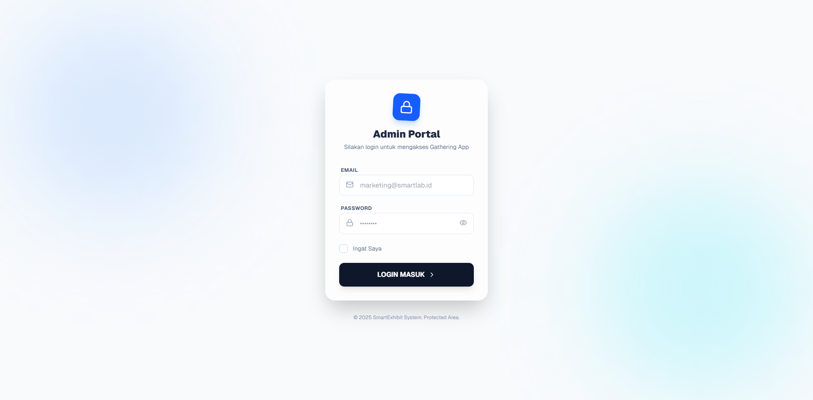
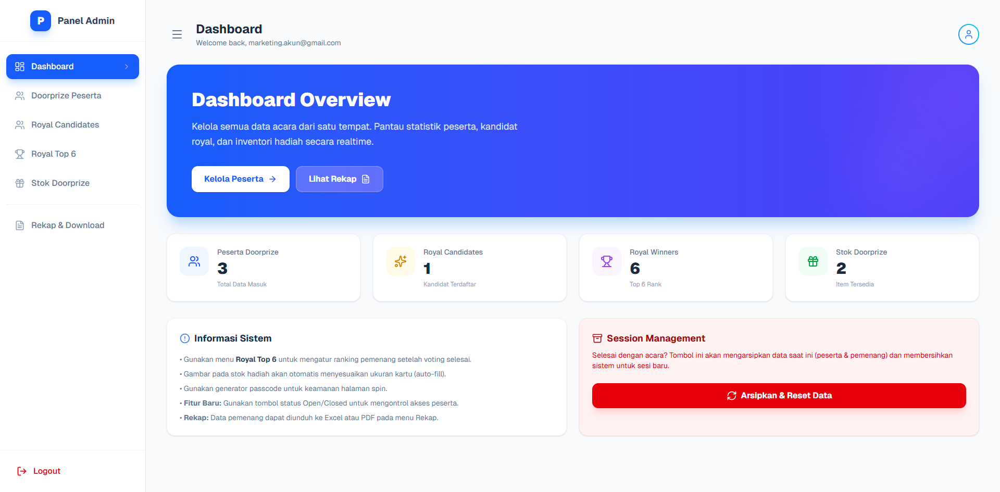
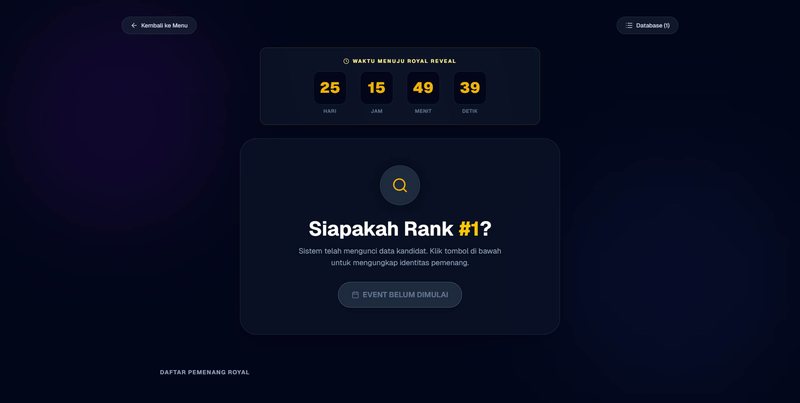
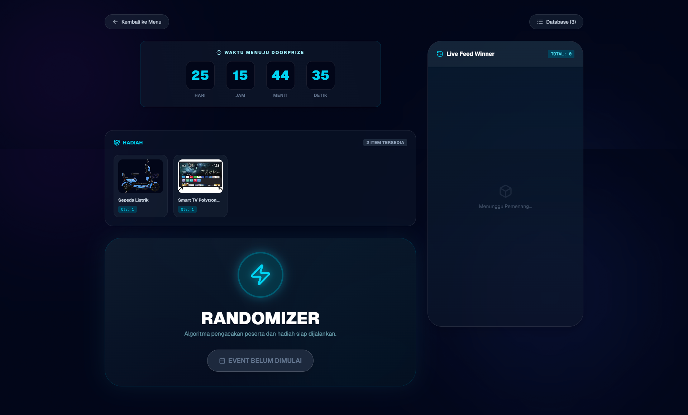

# 💎 SmartRewards

<div align="center">


[](https://nextjs.org/)
[](https://www.typescriptlang.org/)
[](https://firebase.google.com/)
[](https://tailwindcss.com/)
[](https://www.framer.com/motion/)

<p align="center">
  <strong>Platform Manajemen Event & Apresiasi Karyawan Terintegrasi</strong><br>
  Dirancang untuk PT Smartlab Indonesia dengan fitur Real-time Doorprize, Voting Penghargaan, dan Keamanan Tingkat Lanjut.
</p>

[View Demo](https://smart-rewards.vercel.app/) · [Report Bug](https://github.com/kyy-95631488/SmartRewards/issues) · [Request Feature](https://github.com/kyy-95631488/SmartRewards/issues)

</div>

---

## 📖 Ringkasan Project

**SmartRewards** adalah aplikasi web modern yang dibangun untuk menangani acara "Gathering & Appreciation Night". Aplikasi ini menggabungkan sisi **Admin Panel** yang kuat untuk manajemen data dan **Front-end Display** yang interaktif dan penuh animasi untuk ditampilkan di layar besar saat acara berlangsung.

Dibangun dengan **Next.js App Router**, aplikasi ini memanfaatkan **Firebase** untuk sinkronisasi data secara real-time antar perangkat (Admin mengontrol, Layar Peserta berubah seketika).

## ✨ Fitur Utama

### 🔐 Keamanan & Autentikasi (Auth)
* **Role-Based Access Control:** Login khusus untuk role `marketing` dan `admin`.
* **Anti Brute-Force:** Sistem penguncian akun sementara setelah 5x percobaan gagal (Timer 30 detik).
* **Session Management:** Opsi "Remember Me" dengan persistensi lokal atau sesi browser.
* **Passcode Protection:** Halaman sensitif (Doorprize/Royal) dilindungi PIN tambahan.

### 🎮 Front-End Display (Event Mode)
* **Immersive UI:** Desain *Glassmorphism* dengan background animasi partikel.
* **Real-time Randomizer:** Algoritma pengacakan pemenang Doorprize dengan efek suara dan visual "slot machine".
* **Royal Reveal Sequence:** Animasi pengungkapan pemenang Top 6 dengan efek dramatis dan *confetti*.
* **Countdown Timer:** Hitung mundur otomatis menuju waktu acara yang disinkronkan dengan server.
* **Live Feed:** Menampilkan riwayat pemenang secara langsung di sisi layar.

### 🛠️ Admin Panel (Back-Office)
* **Dashboard Overview:** Statistik real-time peserta, stok hadiah, dan status sesi.
* **Inventory Management:** Kelola stok hadiah, upload gambar (via Supabase Storage), dan auto-fill kartu hadiah.
* **Session Control:** Buka/Tutup akses sesi dan atur jadwal acara secara dinamis.
* **Export Data:** Unduh laporan pemenang ke format **Excel (.xlsx)**, **CSV**, dan **PDF** siap cetak.
* **Archiving System:** Fitur reset sesi yang cerdas; mengarsipkan data lama sebelum memulai sesi baru.

---

## 🏗️ Teknologi yang Digunakan

| Kategori | Teknologi | Kegunaan |
| :--- | :--- | :--- |
| **Frontend** | Next.js 14, React | Framework utama aplikasi |
| **Language** | TypeScript | Type safety dan skalabilitas kode |
| **Styling** | Tailwind CSS | Utility-first CSS framework |
| **Animation** | Framer Motion | Animasi UI, transisi halaman, dan efek partikel |
| **Database** | Firebase Firestore | NoSQL Database Real-time |
| **Auth** | Firebase Auth | Autentikasi pengguna aman |
| **Storage** | Supabase Storage | Penyimpanan gambar hadiah |
| **Icons** | Lucide React | Ikonografi modern |
| **Utils** | XLSX, jsPDF | Library untuk export laporan |

---

## 🚀 Cara Menjalankan Project

Ikuti langkah-langkah berikut untuk menjalankan project ini di komputer lokal Anda.

### Prasyarat
* Node.js (versi 18 atau terbaru)
* Akun Firebase & Supabase

### 1. Clone Repository
```bash
git clone [https://github.com/kyy-95631488/SmartRewards.git](https://github.com/username/project-name.git)
cd SmartRewards
```

### 2. Install Dependencies
```bash
npm install
# atau
yarn install
```

### 3. Konfigurasi Environment Variables
Buat file `.env.local` di root folder dan isi dengan konfigurasi berikut:

```env
# Firebase Configuration
NEXT_PUBLIC_FIREBASE_API_KEY=your_api_key
NEXT_PUBLIC_FIREBASE_AUTH_DOMAIN=your_project_id.firebaseapp.com
NEXT_PUBLIC_FIREBASE_PROJECT_ID=your_project_id
NEXT_PUBLIC_FIREBASE_STORAGE_BUCKET=your_project_id.firebasestorage.app
NEXT_PUBLIC_FIREBASE_MESSAGING_SENDER_ID=your_sender_id
NEXT_PUBLIC_FIREBASE_APP_ID=your_app_id
NEXT_PUBLIC_FIREBASE_MEASUREMENT_ID=your_measurement_id

# Supabase Configuration (Untuk Upload Gambar)
NEXT_PUBLIC_SUPABASE_URL=your_supabase_url
NEXT_PUBLIC_SUPABASE_ANON_KEY=your_supabase_anon_key
```

### 4. Jalankan Development Server
```bash
npm run dev
```
Buka [http://localhost:3000](http://localhost:3000) di browser Anda.

---

## 📂 Struktur Folder

Berikut adalah gambaran singkat struktur project penting:

```
├── app/
│   ├── auth/
│   │   └── login/       # Halaman Login dengan proteksi Brute-force
│   ├── panel/           # Dashboard Admin (Protected Route)
│   ├── page.tsx         # Halaman Utama (Event Display)
│   └── globals.css      # Global Styles & Tailwind Directives
├── lib/
│   ├── firebase.ts      # Inisialisasi Firebase App
│   └── supabase.ts      # Inisialisasi Supabase Client
├── components/          # Komponen UI Reusable (jika ada)
├── public/              # Aset statis (Logo, Backgrounds)
└── ...
```

---

## 📸 Pratinjau Aplikasi

| Halaman Login | Dashboard Admin |
| :---: | :---: |
|  |  |
| *Login aman dengan animasi background* | *Manajemen data & export report* |

| Event Randomizer | Royal Reveal |
| :---: | :---: |
|  |  |
| *Pengacakan pemenang real-time* | *Animasi pengumuman pemenang* |

---

## 🛡️ Aturan Keamanan & Akses

1.  **Login:** Hanya pengguna dengan email yang terdaftar di Firestore collection `users` dengan role `marketing` yang bisa masuk ke panel admin.
2.  **Sesi Event:** Halaman Doorprize dan Royal Award dilindungi oleh **Passcode** yang diatur melalui Admin Panel.
3.  **Status Sesi:** Jika Admin mengatur status sesi ke `Closed`, halaman depan tidak dapat diakses meskipun memiliki passcode.

---

## 🤝 Kontribusi

Kontribusi selalu diterima! Silakan ikuti langkah ini:

1.  Fork project ini.
2.  Buat feature branch (`git checkout -b feature/FiturKeren`).
3.  Commit perubahan Anda (`git commit -m 'Menambahkan fitur keren'`).
4.  Push ke branch (`git push origin feature/FiturKeren`).
5.  Buka Pull Request.

---

## 📄 Lisensi

Didistribusikan di bawah Lisensi GNU GENERAL PUBLIC LICENSE. Lihat `LICENSE` untuk informasi lebih lanjut.

---

<p align="center">
  Dibuat dengan ❤️ oleh Tim Magang IT PT Smartlab Indonesia ( Hendriansyah Rizky Setiawan )<br>
  © 2025 SmartRewards System
</p>